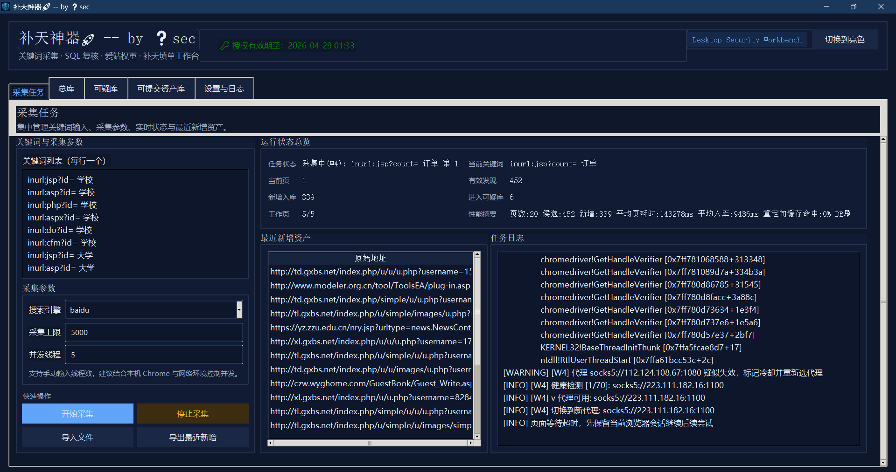
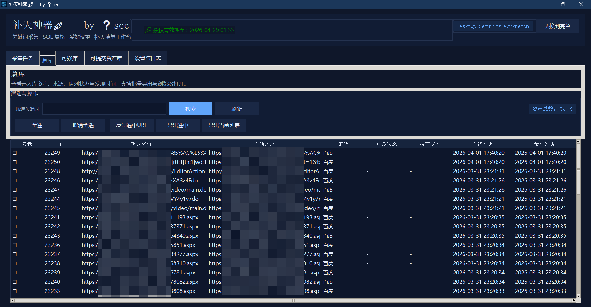
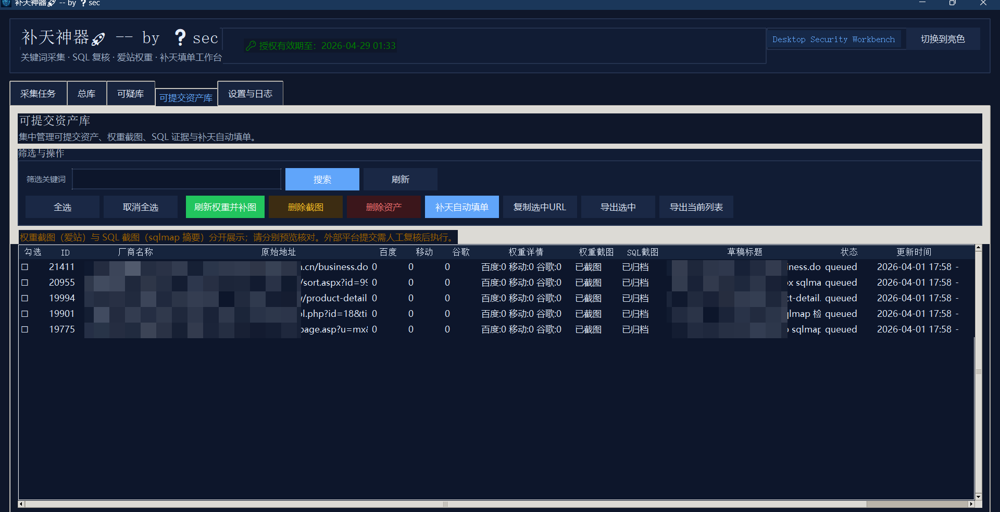
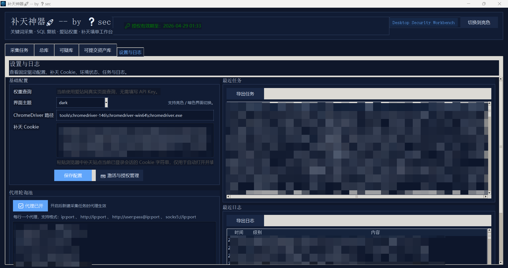

# 补天神器 v2026.04.02

一个面向 Windows 的本地桌面工具，用来辅助做“关键词采集 -> 可疑资产筛选 -> SQL 复核 -> 权重截图 -> 补天填单”的完整工作流。

---

## 这个工具能做什么

- 批量采集百度 / Google 搜索结果中的目标 URL
- 自动去重并整理成资产总库
- 自动识别带参数的疑似 SQL 注入目标，进入可疑库
- 对可疑资产做二次 SQL 复核
- 查询爱站权重并自动补截图
- 生成补天提交内容并自动填写到补天提交页
- 本地保存任务日志、资产状态和处理记录

---

## 适合谁使用

- 需要批量整理搜索结果资产的人
- 需要对疑似 SQL 注入目标做快速筛选和复核的人
- 需要把复核后的目标整理成补天提交草稿的人

---

## 使用前准备

请先确认以下环境：

- Windows 系统
- 本机已安装 Google Chrome
- 可以正常访问百度 / Google / 爱站 / 补天
- 已准备好补天登录后的 Cookie
- 已获得本工具的激活码

如果程序提示找不到 ChromeDriver，请到“设置与日志”页面配置 ChromeDriver 路径。

---

## 快速上手

### 1. 启动程序

双击运行发布包中的 EXE。

首次启动时会弹出激活窗口：

- 复制机器码
- 向作者申请激活码
- 输入激活码完成授权

### 2. 配置基础信息

打开“设置与日志”页面，建议先完成以下配置：

- 检查 ChromeDriver 路径
- 粘贴补天 Cookie
- 保存配置

### 3. 采集关键词

打开“采集任务”页面：

1. 输入关键词，每行一个
2. 选择搜索引擎
3. 设置采集上限
4. 设置并发线程
5. 点击“开始采集”

采集过程中如果遇到验证码，请按提示在浏览器里手动完成验证。

### 4. 查看可疑资产

采集结束后进入“可疑库”页面：

- 查看疑似目标
- 选择要继续处理的资产
- 点击“SQLMap检测并流转”

命中的资产会自动流转到“可提交资产库”。

### 5. 补权重与截图

打开“可提交资产库”页面：

- 点击“刷新权重并补图”
- 检查权重截图是否补齐
- 检查 SQL 证据是否已经归档

### 6. 自动填写补天页面

在“可提交资产库”中单选一条资产，点击“补天自动填单”。

程序会：

- 打开补天提交页
- 自动注入 Cookie
- 自动填写标题、目标、描述、修复建议、地区、行业、权重等内容
- 自动上传并插入截图

填写完成后，浏览器会保持打开，方便你人工检查。

### 7. 人工核对并提交

当前版本不会自动提交补天表单。  
请在浏览器中人工核对后再手动提交。

---

## 页面说明

### 采集任务

- 输入关键词

- 启动 / 停止采集

- 查看实时状态

- 查看最近新增资产

- 查看运行日志

  

### 总库

- 查看全部已入库资产
- 搜索、复制、导出
- 批量浏览器打开

### 可疑库

- 查看疑似资产
- 标记忽略
- 手动移入可提交库
- 做 SQL 复核并自动流转

### 可提交资产库

- 查看可提交目标
- 刷新权重并补图
- 删除截图
- 删除资产
- 自动填写补天页面

### 设置与日志

- 配置 ChromeDriver
- 配置补天 Cookie
- 查看最近任务
- 查看最近日志
- 查看环境状态

---

## 使用注意事项

- 本工具只适用于合法、授权范围内的安全测试场景
- 补天滑块验证需要人工处理
- 补天最终提交需要人工确认
- 补天 Cookie 失效后，需要重新在设置页更新并保存
- 如果页面结构变动，自动填表可能需要更新后再使用

---

## 常见问题

### 1. 程序打不开浏览器

通常是 ChromeDriver 路径不正确，或 Chrome 版本与 ChromeDriver 不匹配。  
请先到“设置与日志”页面检查路径。

### 2. 补天页面没有自动登录

通常是补天 Cookie 过期或复制不完整。  
请重新获取登录后的 Cookie，再到设置页保存。

### 3. 点击补天自动填单后页面打开失败

先检查：

- 当前网络是否正常
- 是否能直接打开 `www.butian.net`
- Chrome 是否能正常启动
- Cookie 是否仍有效

### 4. 权重截图一直缺失

先检查：

- 能否访问爱站页面
- 当前目标域名是否能被正确查询
- 是否被验证码 / 异常页面拦截

---

## 免责声明

请仅在合法授权范围内使用本工具。  
因未授权测试、违规提交、擅自扩大测试范围而导致的任何问题，请使用者自行承担责任。

